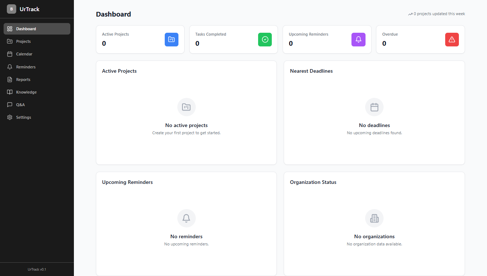
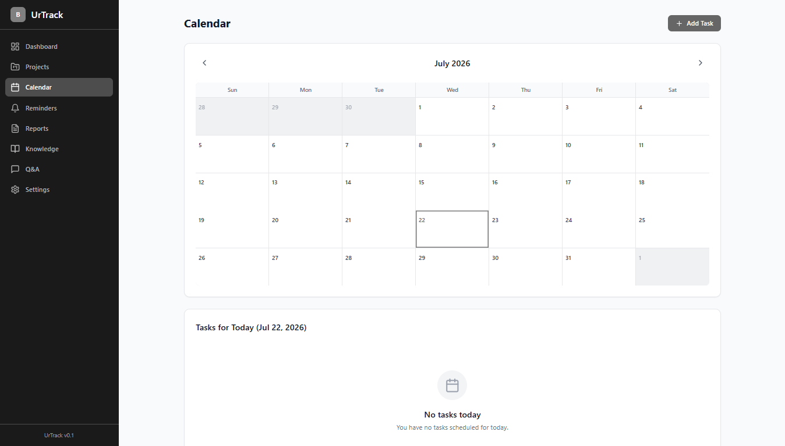
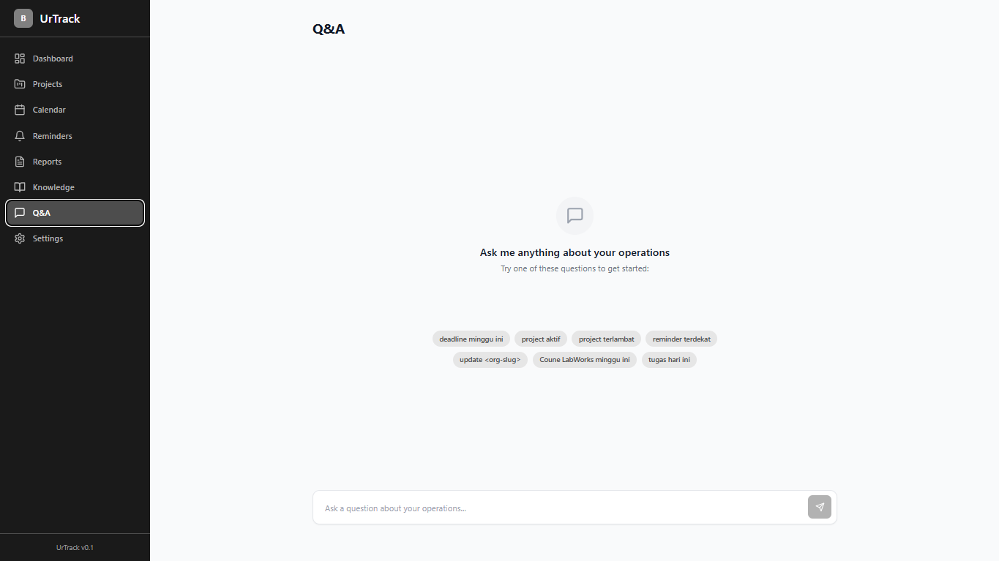

# UrTrack — Home-Tailnet Server Based Project Tracker

A lightweight, self-hosted project tracker designed for home-tailnet servers. Track projects, tasks, reminders, notes, reports, and Q&A — all behind your own firewall.

## Features

- **Dashboard** — overview of all organizations, project counts, weekly progress
- **Projects** — create, filter, and manage projects with progress tracking
- **Reminders** — recurring reminders with next-run scheduling
- **Knowledge Base** — category-organized notes with search
- **Reports** — generate project status reports
- **Calendar** — monthly calendar with tasks and events
- **Q&A** — ask natural-language questions about your data
- **Settings** — backup config, export data, manage tags

## Screenshots


*Dashboard — overview of organizations and project progress*


*Calendar — monthly view with tasks and events*


*Q&A — natural-language question answering*

## Tech Stack

| Layer     | Technology                              |
|-----------|-----------------------------------------|
| Frontend  | React 19, TypeScript, Vite, Tailwind CSS, Recharts |
| Backend   | Python 3.13+, FastAPI, SQLAlchemy, SQLite |
| Deploy    | systemd, Nginx (optional), Debian       |

## Quick Start

### Prerequisites

- Debian 12+ server (or any Linux with systemd)
- Python 3.13+, Node.js 20+, npm

### Deploy

```bash
# Clone the repo on your server
git clone https://github.com/your-org/urtrack.git /opt/urtrack
cd /opt/urtrack

# Run the setup script as root
sudo bash deploy/setup.sh

# Edit allowed IPs
sudo nano /opt/urtrack/deploy/urtrack.env
```

After setup, the app runs at `http://<server-ip>:8000`.

### Development

```powershell
# 1. Backend
cd backend
python -m venv venv
.\venv\Scripts\Activate
pip install -r requirements.txt
python -m uvicorn app.main:app --reload        # http://localhost:8000

# 2. Frontend (terminal terpisah)
cd frontend
npm install
npm run dev                          # http://localhost:5173
```

> Jika error `ExecutionPolicy` saat Activate, jalankan `Set-ExecutionPolicy -Scope Process -ExecutionPolicy Bypass` dulu.
> Frontend dev server otomatis memproksi `/api` ke `localhost:8000`.

### Build Production

```powershell
cd frontend
npm run build          # output di frontend\dist\
npx vite preview       # preview build lokal
```

## Project Layout

```
urtrack/
├── backend/
│   └── app/
│       ├── config.py          # settings (db path, secret key, ...)
│       ├── database.py        # SQLite engine + session
│       ├── main.py            # FastAPI app + middleware
│       ├── models/            # SQLAlchemy models
│       ├── routers/           # API route handlers
│       ├── schemas/           # Pydantic request/response models
│       └── services/          # backup, export, sync stubs
├── frontend/
│   └── src/
│       ├── components/        # reusable UI components
│       ├── pages/             # route pages
│       ├── hooks/             # React hooks
│       ├── lib/               # API client, utilities
│       └── types/             # TypeScript interfaces
└── deploy/
    ├── setup.sh               # one-shot deploy script
    ├── update.sh              # pull + rebuild + restart
    ├── urtrack.service        # systemd unit file
    └── urtrack.env.template   # environment template
```

## IP Whitelist

By default only `127.0.0.1` is allowed. Edit `ALLOWED_IPS` in `urtrack.env`:

```ini
ALLOWED_IPS=192.168.1.100,203.0.113.50
```

Leave empty to allow all IPs (not recommended on public networks).

## License

MIT
